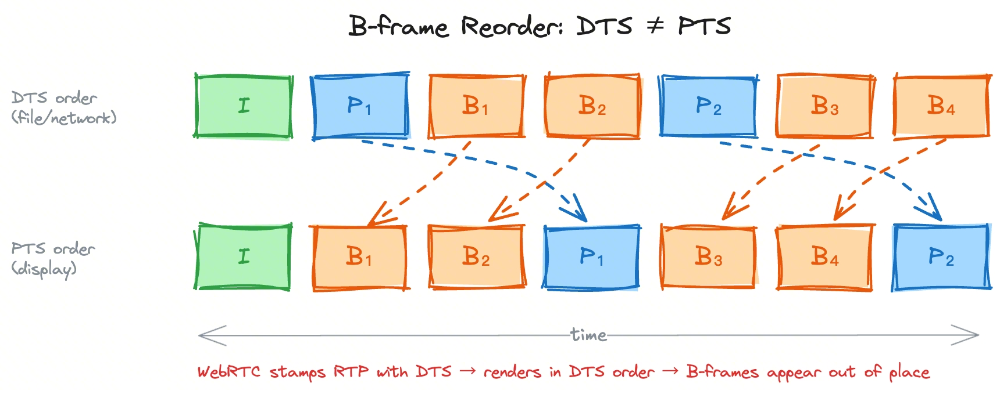
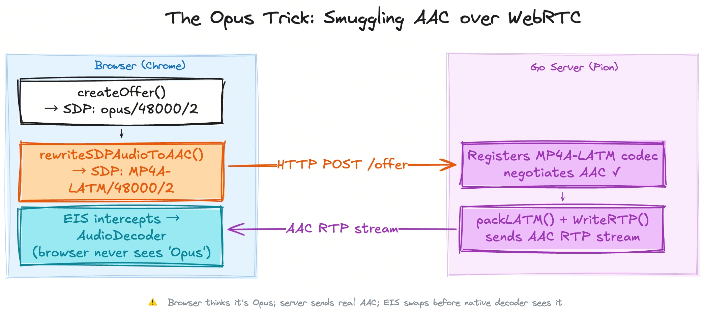
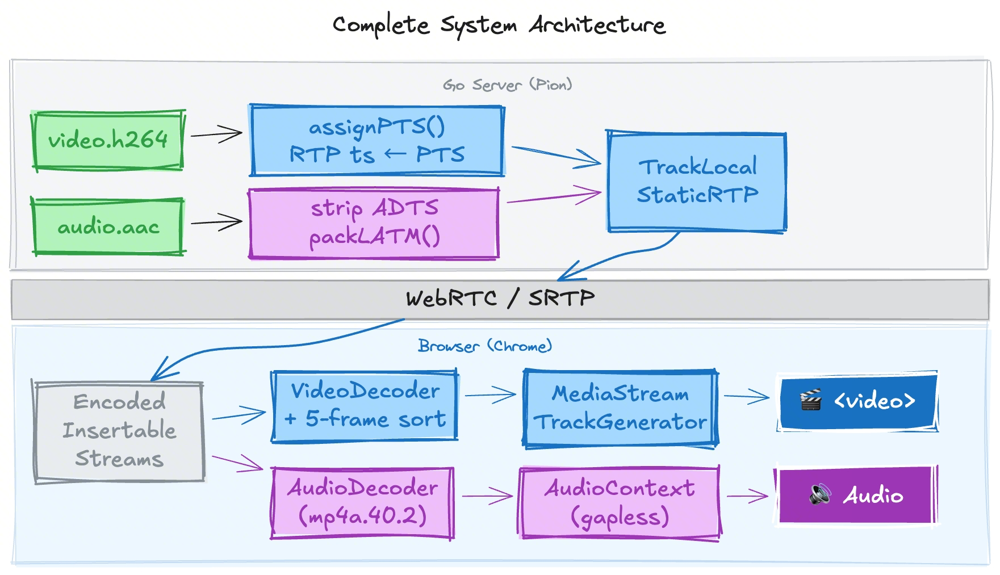

# Playing H.264 B-frames and AAC Audio over WebRTC — Without Patching the Browser

> **TL;DR:** Standard WebRTC stacks set RTP timestamps from DTS, which breaks B-frame video.  We fix this server-side by computing PTS and stamping every RTP packet ourselves, then intercept encoded frames client-side with `EncodedInsertableStreams` and reorder them through a tiny sort buffer before `VideoDecoder`.  AAC gets smuggled in by rewriting the SDP Offer — replacing Opus with `MP4A-LATM` — so the browser never refuses the transceiver.  Complete demo (Go server + plain JS client): [github.com/shushushv/webrtc-bframe-aac](https://github.com/shushushv/webrtc-bframe-aac).

---

## Why This Matters Now

CDN vendors are rapidly adding WebRTC endpoints to their live streaming products, but encoder toolchains default to H.264 with B-frames and AAC audio — both of which WebRTC doesn't natively support.  The collision is well-documented, and the industry's standard fix is **server-side transcoding**, at the cost of added latency and fees:

- **[BytePlus RTM](https://docs.byteplus.com/en/docs/byteplus-media-live/RTM-Streaming-Integration#prerequisites)**: *"If the RTM stream contains B-frames or AAC audio … remove B-frames and transcode the audio to Opus."*

- **[Tencent Cloud LEB](https://www.tencentcloud.com/document/product/267/41030)**: *"The LEB solution for web does not support decoding or playing B-frames. If a stream contains B-frames, the backend will remove them in transcoding, which will increase latency and incur transcoding fees. … Browsers do not support AAC. If a stream contains AAC audio, the system will transcode it into Opus format, which will incur audio transcoding fees."*

- **[AWS IVS](https://docs.aws.amazon.com/ivs/latest/RealTimeUserGuide/rt-stream-ingest.html)**: *"Starting with version 1.25.0, it automatically disables B-frames when broadcasting to an IVS stage. For real-time streaming with other RTMP encoders, developers must disable B-frames."*

- **[Wowza](https://www.wowza.com/docs/how-to-use-webrtc-with-wowza-streaming-engine)**: *"We recommend disabling B-frames for WebRTC streams."*

This post takes the opposite approach: **leave the stream untouched on the server, and handle B-frames and AAC directly in the browser using WebCodecs.**

---

## The Problem

H.264 supports **B-frames** (bidirectional prediction frames).  A B-frame is decoded *after* the frames it references, but *displayed* before them.  This creates a split between two timestamps:

| Timestamp | Meaning | Who uses it |
|-----------|---------|-------------|
| **DTS** (Decode Timestamp) | Order frames must be decoded | Container/demuxer, RTP stack |
| **PTS** (Presentation Timestamp) | Order frames should be displayed | Renderer / `<video>` |

A raw `.h264` annex-B file stores frames in DTS order (I, P₁, B₁, B₂, P₂ …).  Standard WebRTC libraries simply tick the RTP timestamp forward by one frame interval per packet — effectively treating it as DTS.  The browser renders in arrival order, using RTP timestamp as render time.  With B-frames the result is flickering and out-of-order frames.



The usual fix — embedding PTS in an RTSP or MPEG-TS container — doesn't exist in WebRTC.  The RTP packet carries a single 32-bit timestamp field, and most libraries write DTS there.  We need to take full ownership of that field.

---

## Part 1 — Fixing B-frames on the Server

### TrackLocalStaticRTP: owning the timestamp

Pion offers two track types.  `TrackLocalStaticSample` auto-increments the timestamp (always DTS-based).  `TrackLocalStaticRTP` hands us a raw `rtp.Packet` to construct ourselves — we own the timestamp field entirely.  We choose the latter and compute PTS from the DTS-ordered NAL stream before sending anything.

The rule for a group **[P, B₁…Bₙ]** (where P appears in the file first, followed by n B-frames, then the next anchor):

```
P.pts  = lastAnchorPTS + (n+1) × frameDuration
Bᵢ.pts = lastAnchorPTS + i    × frameDuration   (i = 1…n)
```

Units are 90 kHz clock ticks (`frameDuration = 3600` at 25 fps).  Non-picture NALs (SPS, PPS, SEI) inherit the PTS of the picture NAL they precede.  The full `assignPTS` implementation is [in the repo](https://github.com/shushushv/webrtc-bframe-aac/blob/main/server/main.go); detecting B-frames uses `github.com/Eyevinn/mp4ff/avc` to parse `slice_type` from the NAL header.

### The implicit dual-timestamp trick

This is the core insight.  We send frames in **DTS order** (exactly as they appear in the file — the decoder must see them this way), but we write **PTS into the RTP timestamp field**.

That single change implicitly carries *both* timestamps:
- **DTS is implicit** — packet arrival order equals DTS order, because we never reorder frames before sending.
- **PTS is explicit** — it's in the RTP timestamp field, available via `getMetadata().rtpTimestamp`.

The receiver can reconstruct the full picture without any extra signalling: process frames as they arrive (DTS order), but schedule rendering using the RTP timestamp (PTS).  No container format, no side-channel, just the standard 32-bit RTP timestamp field used correctly.

The key line — stamping each RTP packet with PTS rather than DTS:

```go
pkt := &rtp.Packet{
    Header: rtp.Header{
        Timestamp: pts,   // ← PTS, not DTS
        Marker:    i == len(payloads)-1,
        // ...
    },
    Payload: payload,
}
videoTrack.WriteRTP(pkt)
```

One extra detail: when the file loops, add the total duration of the previous pass to `pts` so the RTP timestamp is always monotonically increasing.  A backward jump causes the browser's jitter buffer to discard most frames.

---

## Part 2 — Decoding B-frames on the Client

Even with correct PTS in the RTP timestamp, the browser's built-in H.264 decoder renders in arrival order.  The `<video>` element has no concept of "hold this frame until its B-frames arrive."  We bypass the native pipeline entirely.

### EncodedInsertableStreams intercepts before the native decoder

`EncodedInsertableStreams` lets us tap the encoded frame stream between the RTP layer and the browser decoder.  We redirect everything to our own `VideoDecoder` via a `TransformStream`, then sort frames by the `rtpTimestamp` exposed in `RTCEncodedVideoFrame.getMetadata()`.

```js
_onFrame(frame) {
    this._frameBuffer.push(frame);
    this._frameBuffer.sort((a, b) => a.timestamp - b.timestamp);

    if (this._frameBuffer.length >= this.bufferSize) {  // default: 5
        const oldest = this._frameBuffer.shift();
        this._writer.write(oldest).then(() => oldest.close());
    }
}
```

The buffer depth must be at least `maxBframes + 1`.  Five frames adds ~200 ms of latency at 25 fps — acceptable for most streaming use cases.  Decoded `VideoFrame` objects are written to a `MediaStreamTrackGenerator` attached to a `<video>` element.  Full intercept + decode wiring: [`web/video-player.js`](https://github.com/shushushv/webrtc-bframe-aac/blob/main/web/video-player.js).

---

## Part 3 — AAC Audio: The Opus Trick

### The browser codec wall

The WebRTC spec only mandates Opus for audio.  When you call `pc.addTransceiver('audio', { direction: 'recvonly' })` the browser generates an SDP Offer containing only `opus/48000/2`.  There is no API to substitute a different codec.

AAC is not on the mandatory list.  Registering a custom `MP4A-LATM` codec in Pion and returning it in the Answer causes Chrome to reject the connection silently.

### The fix: rewrite the SDP string before sending

The browser's Offer is just a string.  We rewrite it *after* `createOffer()` but *before* posting it to the server:

```js
function rewriteSDPAudioToAAC(sdp, sampleRate) {
    const match = sdp.match(/a=rtpmap:(\d+) opus\/48000\/2/i);
    if (!match) return sdp;
    const pt = match[1];
    return sdp
        .replace(new RegExp(`a=rtpmap:${pt} opus/48000/2`, 'i'),
                 `a=rtpmap:${pt} MP4A-LATM/${sampleRate}/2`)
        .replace(new RegExp(`a=fmtp:${pt} [^\r\n]+`),
                 `a=fmtp:${pt} profile-level-id=1;object=2;cpresent=0`);
}
```

The browser already created the transceiver (it thinks it's Opus).  The server sees `MP4A-LATM`, negotiates AAC, and streams it.  `EncodedInsertableStreams` intercepts the incoming RTP *before* it reaches the native Opus decoder, and `AudioDecoder` handles decoding instead.



### Server-side: RFC 3016 LATM packaging

The server strips the 7-byte ADTS header from each frame and wraps it in RFC 3016 LATM format (a variable-length prefix followed by the raw AAC frame).  The SDP `fmtp` line carries a `config=` hex string encoding a **StreamMuxConfig** (ISO 14496-3) computed dynamically from the source file's ADTS header — profile, sampling rate index, channel count.  Full implementation: [`server/audio.go`](https://github.com/shushushv/webrtc-bframe-aac/blob/main/server/audio.go).

The resulting SDP Answer looks like:

```
a=fmtp:97 profile-level-id=1;object=2;cpresent=0;config=400024103fc0
```

### Client-side: AudioDecoder + AudioContext

The client strips the LATM length prefix and feeds raw AAC frames to `AudioDecoder` (codec `mp4a.40.2`).  Decoded `AudioData` objects are scheduled for gapless playback through `AudioContext` using a simple `nextPlayTime` accumulator.  Full wiring: [`web/audio-player.js`](https://github.com/shushushv/webrtc-bframe-aac/blob/main/web/audio-player.js).

---

## Architecture



---

## Running the Demo

```bash
git clone https://github.com/shushushv/webrtc-bframe-aac
cd webrtc-bframe-aac
go run ./server/
```

Open `http://localhost:8080`, click **Subscribe**.  Chrome 94+ or Safari 17.4+ required.

To generate your own files with B-frames:

```bash
ffmpeg -i input.mp4 -an -c:v libx264 -bf 2 -g 60 -r 25 sample/video.h264
ffmpeg -i input.mp4 -vn -c:a aac -b:a 128k sample/audio.aac
```

---

## Browser Compatibility

| Feature | Chrome | Firefox | Safari |
|---------|--------|---------|--------|
| `EncodedInsertableStreams` | 86+ | 117+ | 15.4+ |
| `VideoDecoder` | 94+ | 130+ | 16.1+ |
| `MediaStreamTrackGenerator` | 94+ | — | 17.4+ |
| `AudioDecoder` (AAC) | 94+ | 130+ | 16.1+ |
| **Full demo** | **94+** | **—** | **17.4+** |

Firefox lacks `MediaStreamTrackGenerator`, so the video path is Chrome/Safari only.

---

## Limitations and Next Steps

- **Not yet production-ready**: `EncodedInsertableStreams` does not guarantee frame delivery order out of the transform.  Under packet loss or reordering, frames can arrive at the sort buffer out of sequence, causing corruption or decode failures.  This is a known WebRTC issue ([issues.webrtc.org/454162516](https://issues.webrtc.org/issues/454162516)) with a patch under review ([CL 419460](https://webrtc-review.googlesource.com/c/src/+/419460)).
- **No lip-sync**: Video and audio pipelines start independently.  A production build must synchronize them using RTP timestamps.
- **Latency**: The 5-frame sort buffer adds ~200 ms at 25 fps.  Reduce it for streams with fewer B-frames.
- **RTCP**: The server drains RTCP but ignores PLI/FIR keyframe requests.
- **SDP rewrite fragility**: The Opus trick relies on the browser using a specific SDP format for Opus.  Stable across Chrome and Safari for years, but not spec-guaranteed.

---

## Conclusion

Playing H.264 B-frames over WebRTC requires taking ownership of two things: the RTP timestamp (PTS, not DTS) and the decode pipeline (WebCodecs, not the browser's built-in decoder).  Adding AAC on top needs one more workaround — the SDP rewrite — but the result is a fully functional pipeline with no browser patches or custom builds.

Source: [github.com/shushushv/webrtc-bframe-aac](https://github.com/shushushv/webrtc-bframe-aac)
